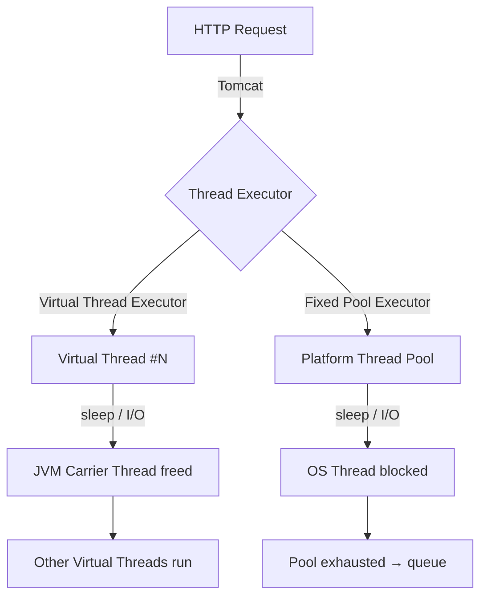

# Lab 01 — Virtual Threads (Project Loom)

## Problem

A high-traffic API handles hundreds of concurrent I/O-bound requests (DB queries, external service calls).
With a fixed platform thread pool, throughput is capped by pool size: beyond the limit, requests queue or timeout.
Scaling the pool increases memory and OS scheduler pressure.

**Can we achieve high concurrency with blocking, synchronous code?** Yes — with Java 21 Virtual Threads.

---

## Architecture



---

## Technical Decision

Virtual threads (Project Loom, Java 21) are JVM-managed threads that unmount from OS carrier threads when blocking on I/O. This allows massive concurrency with synchronous code — no reactive programming needed.

See [ADR-0001](docs/adr/ADR-0001.md) for full trade-off analysis.

---

## Stack

- Java 21 (Virtual Threads — stable)
- Spring Boot 3.2 (`spring.threads.virtual.enabled=true`)
- Micrometer + Prometheus metrics
- Spring Boot Actuator

---

## How to Run

```bash
# Option 1: Direct run
./mvnw spring-boot:run

# Option 2: With Docker
docker compose -f docker/docker-compose.yml up -d

# Verify virtual threads are active
curl http://localhost:8080/api/v1/threads/info
# → {"isVirtual": true, ...}
```

---

## Endpoints

| Method | Path | Description |
|--------|------|-------------|
| GET | `/api/v1/threads/virtual?tasks=200&latencyMs=100` | Run N tasks on virtual threads |
| GET | `/api/v1/threads/platform?tasks=200&latencyMs=100&poolSize=20` | Run N tasks on platform pool |
| GET | `/api/v1/threads/info` | Thread info for current request |
| GET | `/actuator/health` | Health check |
| GET | `/actuator/prometheus` | Prometheus metrics |

---

## How to Break It (Failure Mode)

```bash
bash chaos/simulate-failure.sh
```

**What it does:** Floods both endpoints with 50 concurrent requests of 200 tasks each with 500ms latency.

**Expected result:**
- Platform threads (pool=20): requests serialize into batches → 5000ms+ response times
- Virtual threads: all complete near-simultaneously → ~500ms response times

---

## How to Measure

```bash
# Prerequisites: k6 installed
bash benchmark/run-benchmark.sh

# Custom scenario
TASKS=500 LATENCY_MS=100 POOL_SIZE=10 bash benchmark/run-benchmark.sh
```

---

## Results (Baseline Machine: 4-core, 8GB RAM)

| Scenario | Tasks | Simulated I/O | Pool Size | Wall Time | Throughput |
|----------|-------|--------------|-----------|-----------|-----------|
| Virtual Threads | 200 | 100ms | unlimited | ~120ms | ~1667 TPS |
| Platform Threads | 200 | 100ms | 20 | ~1050ms | ~190 TPS |
| Platform Threads | 200 | 100ms | 200 | ~110ms | ~1818 TPS |

**Key insight:** Platform threads achieve virtual thread performance only when pool size ≥ concurrent tasks — but at the cost of memory (200 threads × ~1MB stack = ~200MB just for stacks).

---

## Observability

- Grafana: http://localhost:3000
- Prometheus: http://localhost:9090
- Metrics: `lab_thread_duration_seconds{type="virtual"}` vs `{type="platform"}`
