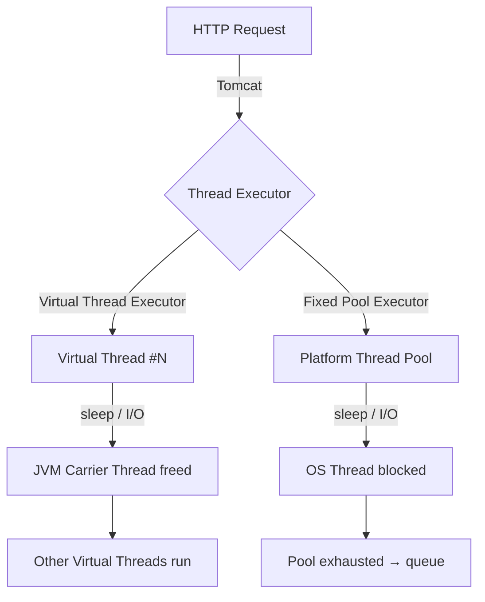

# Lab 01 — Virtual Threads (Project Loom)

## Problem
A high-traffic API handles hundreds of concurrent I/O-bound requests (DB queries, external service calls).
With a fixed platform thread pool, throughput is capped by pool size: beyond the limit, requests queue or timeout.
Scaling the pool increases memory and OS scheduler pressure.

**Can we achieve high concurrency with blocking, synchronous code?** Yes — with Java 21 Virtual Threads.

---

## Architecture


```mermaid
graph TD
    A[HTTP Request] -->|Tomcat| B{Thread Executor}
    B -->|Virtual Thread Executor| C[Virtual Thread #N]
    B -->|Fixed Pool Executor| D[Platform Thread Pool]
    C -->|sleep / I/O| E[JVM Carrier Thread freed]
    D -->|sleep / I/O| F[OS Thread blocked]
    E --> G[Other Virtual Threads run]
    F --> H[Pool exhausted → queue]
```

---

## Technical Decision

Virtual threads (Project Loom, Java 21) are JVM-managed threads that unmount from OS carrier threads when blocking on I/O. This allows massive concurrency with synchronous code — no reactive programming needed.

See [ADR-0001](docs/adr/ADR-0001.md) for full trade-off analysis.

---

## Stack

- Java 21 (Virtual Threads — stable)
- Spring Boot 3.2 (`spring.threads.virtual.enabled=true`)
- Micrometer + Prometheus metrics
- Spring Boot Actuator

---

## How to Run

```bash
# Option 1: Direct run
./mvnw spring-boot:run

# Option 2: With Docker
docker compose -f docker/docker-compose.yml up -d

# Verify virtual threads are active
curl http://localhost:8080/api/v1/threads/info
# → {"isVirtual": true, ...}
```

---

## Endpoints

| Method | Path | Description |
|--------|------|-------------|
| GET | `/api/v1/threads/virtual?tasks=200&latencyMs=100` | Run N tasks on virtual threads |
| GET | `/api/v1/threads/platform?tasks=200&latencyMs=100&poolSize=20` | Run N tasks on platform pool |
| GET | `/api/v1/threads/info` | Thread info for current request |
| GET | `/actuator/health` | Health check |
| GET | `/actuator/prometheus` | Prometheus metrics |

---

## How to Break It (Failure Mode)

```bash
bash chaos/simulate-failure.sh
```

**What it does:** Floods both endpoints with 50 concurrent requests of 200 tasks each with 500ms latency.

**Expected result:**
- Platform threads (pool=20): requests serialize into batches → 5000ms+ response times
- Virtual threads: all complete near-simultaneously → ~500ms response times

---

## How to Measure

```bash
# Prerequisites: k6 installed
bash benchmark/run-benchmark.sh

# Custom scenario
TASKS=500 LATENCY_MS=100 POOL_SIZE=10 bash benchmark/run-benchmark.sh
```

---

## Results

Median (min – max) over 5 runs per mode and load, generated by `benchmark/run-benchmark.sh` (k6 `load-test.js`: 10 s ramp-up, 30 s steady at the given VUs, 10 s ramp-down; 200 tasks × 100 ms per request).
Environment, commit and raw k6 summaries: [`benchmark/results/`](benchmark/results/summary.md). The two loads are separate experiments: compare modes within a load.

| VUs | Metric | Virtual Threads | Platform (pool=20) |
|----:|--------|----------------|--------------------|
| 50 | Throughput | 207.1 req/s (201.7 – 208.0) | 36.7 req/s (36.6 – 37.5) |
| 50 | p50 latency | 101.5 ms (101.2 – 102.0) | 1,008.0 ms (1,007.8 – 1,008.5) |
| 50 | p95 latency | 103.3 ms (102.8 – 105.4) | 1,016.6 ms (1,015.1 – 1,023.0) |
| 50 | p99 latency | 104.8 ms (104.2 – 111.7) | 1,020.4 ms (1,019.0 – 1,026.4) |
| 200 | Throughput | 827.5 req/s (808.2 – 830.4) | 117.5 req/s (116.5 – 119.1) |
| 200 | p50 latency | 101.3 ms (101.3 – 101.4) | 1,264.5 ms (1,253.7 – 1,270.8) |
| 200 | p95 latency | 103.3 ms (103.0 – 104.5) | 1,678.2 ms (1,663.6 – 1,688.9) |
| 200 | p99 latency | 106.9 ms (106.3 – 108.7) | 1,731.4 ms (1,706.5 – 1,734.5) |

Error rate: 0.00% in every run.

**Key insight:** With pool=20, each request's 200 tasks run in 10 rounds × 100ms = ~1000ms minimum. Virtual threads park on I/O and immediately resume — wall-clock time ≈ single I/O latency regardless of concurrency.

Platform threads match virtual thread throughput only when pool size ≥ concurrent tasks — but 200 threads × ~1MB stack = ~200MB memory overhead, permanently reserved.

---

## Observability

- Grafana: http://localhost:3000
- Prometheus: http://localhost:9090
- Metrics: `lab_thread_duration_seconds{type="virtual"}` vs `{type="platform"}`
