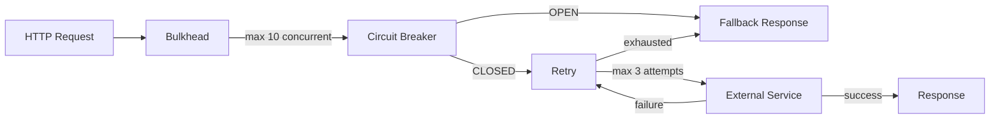

# Lab 02 — Resilience: Circuit Breaker, Retry, Bulkhead

## Problem

An API that depends on external services fails catastrophically when those services go down.
Without protection, thread pools exhaust, retries amplify load, and failures cascade.

**How do you design a system that degrades gracefully when dependencies fail?**

---

## Architecture



**Composition order** (outermost → innermost): `Bulkhead → CircuitBreaker → Retry`

---

## Technical Decision

Resilience4j 2.x with sliding-window circuit breaker. See [ADR-0001](docs/adr/ADR-0001.md).

---

## How to Run

```bash
./mvnw spring-boot:run

# Test healthy state
curl http://localhost:8081/api/v1/call

# Inject 80% failure rate
curl -X POST "http://localhost:8081/api/v1/admin/failure-rate?percent=80"

# Watch circuit open
for i in $(seq 1 15); do curl -s "http://localhost:8081/api/v1/call?requestId=test-$i" | python3 -m json.tool; done
```

---

## Circuit Breaker Configuration

| Parameter | Value | Rationale |
|-----------|-------|-----------|
| `failureRateThreshold` | 50% | Open if >50% of last 10 calls fail |
| `minimumNumberOfCalls` | 10 | Need 10 data points before evaluating |
| `waitDurationInOpenState` | 10s | Stay open 10s before probing |
| `permittedCallsInHalfOpen` | 3 | 3 probes to decide CLOSE or reopen |

---

## How to Break It

```bash
bash chaos/simulate-failure.sh
```

Watch the circuit transition: `CLOSED → OPEN → HALF_OPEN → CLOSED`

---

## How to Measure

```bash
bash benchmark/run-benchmark.sh
```

---

## Observability

```bash
# Circuit breaker state
curl http://localhost:8081/actuator/health | jq '.components.circuitBreakers'

# Prometheus metrics
curl http://localhost:8081/actuator/prometheus | grep resilience4j
```

Key metrics:
- `resilience4j_circuitbreaker_state` — 0=CLOSED, 1=OPEN, 2=HALF_OPEN
- `resilience4j_retry_calls_total{kind="successful_without_retry|successful_with_retry|failed_with_retry|failed_without_retry}`
- `lab_external_calls_total{outcome="success|failure|fallback"}`
