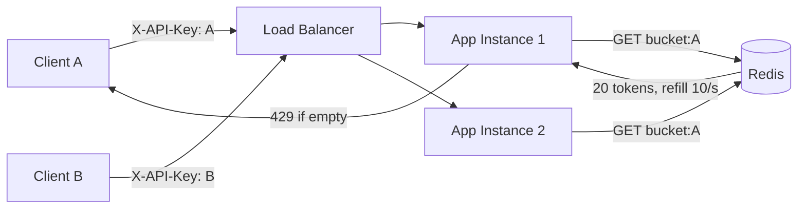

# Lab 03 — Rate Limiter: Distributed Token Bucket

## Problem

A public API receives 10× normal traffic from a burst of clients.
Without rate limiting, the service is overwhelmed and degrades for all users.
An in-memory rate limiter breaks when multiple app instances run behind a load balancer.

**How do you enforce per-client rate limits consistently across a distributed system?**

---

## Architecture



---

## How to Run

```bash
docker compose -f docker/docker-compose.yml up -d
./mvnw spring-boot:run

# Test: first 20 requests pass, then 429
for i in $(seq 1 25); do
  echo -n "req-$i: "
  curl -s -o /dev/null -w "%{http_code}\n" http://localhost:8082/api/v1/resource -H "X-API-Key: my-key"
done
```

---

## Rate Limit Policy

| Parameter | Value |
|-----------|-------|
| Bucket capacity (burst) | 20 tokens |
| Refill rate | 10 tokens/second |
| Strategy | Token bucket (greedy refill) |
| State store | Redis |
| Client key | `X-API-Key` header |

---

## How to Break It

```bash
bash chaos/simulate-failure.sh
```

Stops Redis to demonstrate fail-open behavior.

---

## How to Measure

```bash
bash benchmark/run-benchmark.sh
```

---

## Observability

```bash
curl http://localhost:8082/actuator/prometheus | grep lab_ratelimiter
```

Metrics: `lab_ratelimiter_requests_total{outcome="allowed|rejected"}`
