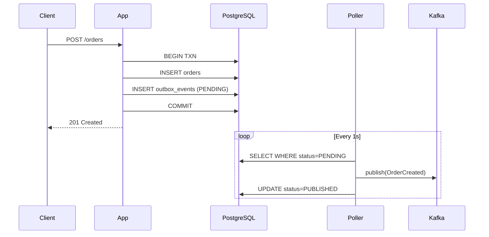
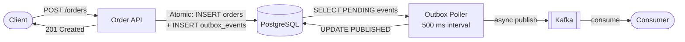
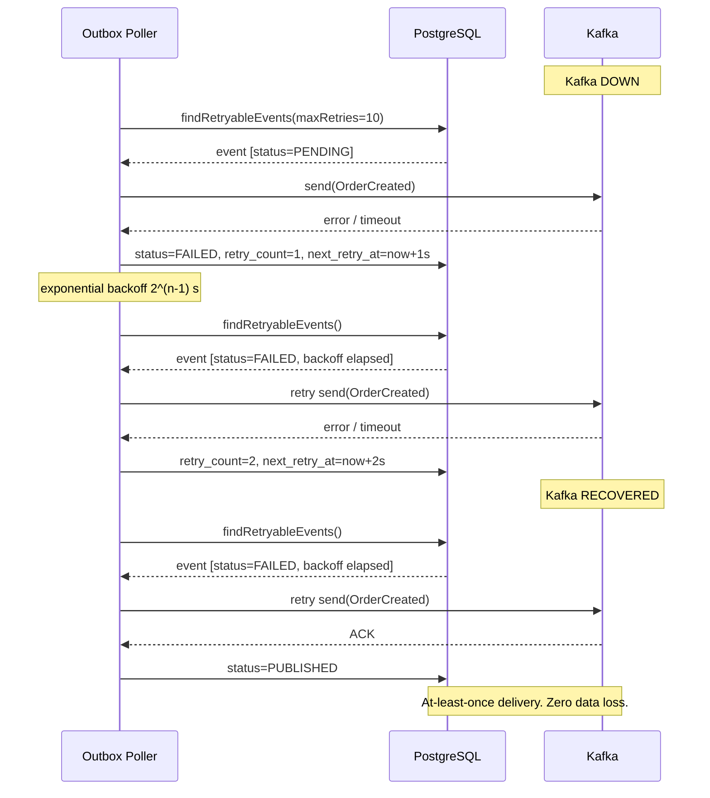

# Lab 04 — Transactional Outbox Pattern

## Problem

An order service must persist an order in PostgreSQL AND notify inventory/shipping via Kafka.
The dual-write problem: if Kafka is down after the DB commit, the event is lost.
If the app crashes mid-flight, the event is lost. The customer is charged but nothing ships.

**How do you guarantee event delivery without distributed transactions?**

---

## Architecture



---

## Key Guarantee

**If the DB transaction commits, the event WILL be delivered.**
Kafka downtime = events queue in the outbox. When Kafka recovers, the poller drains the backlog.

---

## What this lab demonstrates

### 1. Normal flow — atomic write, async delivery



The order and its outbox event are written in a **single DB transaction** — either both persist or neither does.
Kafka publishing happens asynchronously after the commit, so client latency is never affected by broker availability.
This is **eventual consistency**: the order exists in PostgreSQL immediately; the Kafka event arrives within milliseconds.

---

### 2. Retry / recovery flow — at-least-once after Kafka failure



`findRetryableEvents()` returns both `PENDING` events and `FAILED` events whose backoff window has elapsed.
Each failure increments `retry_count` and schedules the next attempt at `now + min(2^(n−1), 60)` seconds.
After `max-retries` (default: 10) the event stays `FAILED` permanently and requires manual intervention.
**No duplicates** are introduced: once an event reaches `PUBLISHED` it is never picked up again.

---

## How to Run

```bash
docker compose -f docker/docker-compose.yml up -d
./mvnw spring-boot:run

# Create an order
curl -X POST http://localhost:8083/api/v1/orders \
  -H "Content-Type: application/json" \
  -d '{"customerId":"customer-1","amount":99.99}'

# Check outbox stats
curl http://localhost:8083/api/v1/orders/outbox/stats
```

---

## How to Break It

```bash
bash chaos/simulate-failure.sh
```

Stops Kafka, creates 5 orders, then restarts Kafka. Shows events queue and drain.

---

## How to Measure

```bash
bash benchmark/run-benchmark.sh
```

Key metric: `SELECT COUNT(*) FROM outbox_events WHERE status='PENDING'` — this is your delivery lag gauge.

---

## See Also

- [ADR-0001](docs/adr/ADR-0001.md): Why Outbox over dual-write or Debezium
