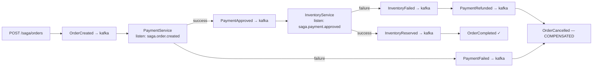

# Lab 05 — Saga Pattern: Distributed Transactions

## Problem

A purchase requires coordinating payment (charge card) and inventory (reserve stock).
Both must succeed, or both must undo their work. There's no distributed lock.

**How do you maintain consistency across multiple services without 2-phase commit?**

---

## Architecture



---

## Saga Topics

| Topic | Publisher | Consumer |
|-------|-----------|---------|
| `saga.order.created` | Order service | Payment service |
| `saga.payment.approved` | Payment service | Inventory service |
| `saga.payment.failed` | Payment service | Order service |
| `saga.inventory.reserved` | Inventory service | Order service |
| `saga.inventory.failed` | Inventory service | Payment service |
| `saga.payment.refunded` | Payment service | Order service |

---

## How to Run

```bash
docker compose -f docker/docker-compose.yml up -d
./mvnw spring-boot:run

# Happy path
curl -X POST http://localhost:8084/api/v1/saga/orders \
  -H "Content-Type: application/json" \
  -d '{"customerId":"c1","amount":49.99}'

# Check status
curl http://localhost:8084/api/v1/saga/orders/{id}
```

---

## How to Break It (Compensation)

```bash
bash chaos/simulate-failure.sh
```

Triggers inventory failure → payment compensation → order cancelled.

---

## Observability

```bash
curl http://localhost:8084/api/v1/saga/stats
curl http://localhost:8084/actuator/prometheus | grep lab_saga
```

See [ADR-0001](docs/adr/ADR-0001.md) for choreography vs orchestration trade-offs.
