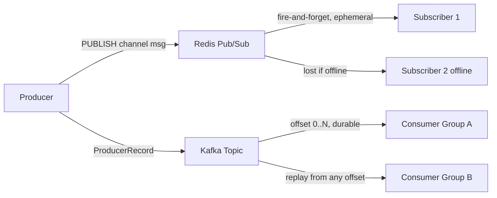

# Lab 06 — Redis vs Kafka: Messaging Trade-offs

## Problem

Two services need to communicate. Redis Pub/Sub and Kafka are both valid options.
Choosing the wrong one leads to either data loss (Redis for critical events) or
unnecessary complexity (Kafka for ephemeral notifications).

**How do you choose the right messaging backend?**

---

## Architecture



---

## Run

```bash
docker compose -f docker/docker-compose.yml up -d
./mvnw spring-boot:run

# Compare
curl "http://localhost:8085/api/v1/benchmark/compare?messages=1000"
```

---

## Decision Matrix

| Use Case | Redis | Kafka |
|----------|-------|-------|
| Cache invalidation | ✅ | ❌ overkill |
| Live WebSocket push | ✅ | ❌ overkill |
| Payment events | ❌ no durability | ✅ |
| Audit log | ❌ | ✅ |
| Multi-consumer replay | ❌ | ✅ |

See [ADR-0001](docs/adr/ADR-0001.md) for full analysis.

---

## How to Break It

```bash
bash chaos/simulate-failure.sh
```

Shows Redis message loss vs Kafka queue persistence.
