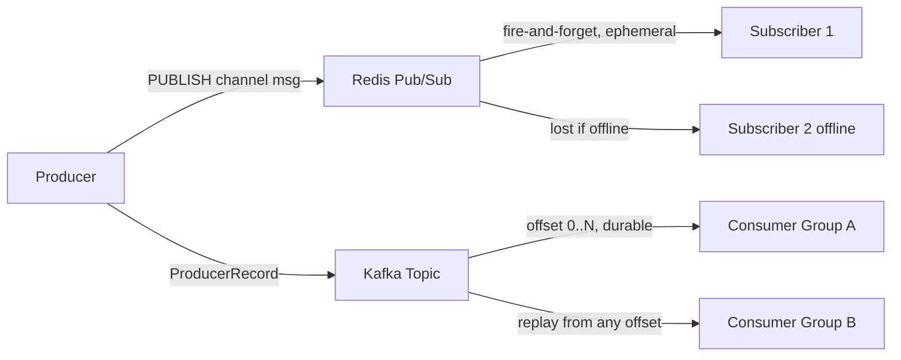

# Lab 06 — Redis Pub/Sub vs Kafka: Messaging Trade-offs

## Problem

Two services need to communicate. Redis Pub/Sub and Kafka are both valid options.
Choosing the wrong one leads to either data loss (Redis for critical events) or
unnecessary complexity (Kafka for ephemeral notifications).

**How do you choose the right messaging backend?**

---

## Architecture


```mermaid
graph LR
    A[Producer] -->|PUBLISH channel msg| R[Redis Pub/Sub]
    A -->|ProducerRecord| K[Kafka Topic]
    R -->|fire-and-forget, ephemeral| S1[Subscriber 1]
    R -->|lost if offline| S2[Subscriber 2 offline]
    K -->|offset 0..N, durable| C1[Consumer Group A]
    K -->|replay from any offset| C2[Consumer Group B]
```

---

## Benchmark Results

> Full analysis: [`benchmark/results/summary.md`](benchmark/results/summary.md)

### Baseline load test — 1,000 messages, single-threaded producer

| Metric                 | Redis Pub/Sub | Kafka (async) |
|------------------------|:-------------:|:-------------:|
| Throughput (msg/s)     | 2,227         | 47,619        |
| Publish p50 (µs)       | 419           | 7             |
| Publish p99 (µs)       | 790           | 119           |
| Delivery rate          | 100%          | 100%          |

### Why Kafka shows higher throughput — the API asymmetry

The 21× gap is real but **does not mean Kafka is faster in all scenarios**.
It reflects a fundamental difference in what each Spring API call does:

```
Redis convertAndSend():         Kafka send():
  serialize                       serialize
  TCP write ──────────────→       write to RecordAccumulator  ← returns here (~7µs)
  wait for Redis ack              [Sender thread, background:]
  TCP read  ←─────────────          TCP write to broker
  return (~419µs)                   disk fsync
                                    ISR replication ack
                                  complete CompletableFuture
```

| What the timer includes     | Redis `convertAndSend` | Kafka `send()` |
|-----------------------------|:----------------------:|:--------------:|
| Serialization               | ✅                     | ✅             |
| Write to local buffer       | ✅                     | ✅             |
| TCP round-trip to broker    | ✅                     | ❌             |
| Disk write + ISR ack        | ✅                     | ❌             |
| Fan-out to subscribers      | ✅                     | ❌             |

The benchmark measures the cost of each API call from the **application thread**.
Redis pays full network RTT per message; Kafka defers all network I/O to a background thread.

### How the numbers change under equivalent conditions

| Comparison mode               | Redis        | Kafka           |
|-------------------------------|:------------:|:---------------:|
| Default Spring API (measured) | 2,227 msg/s  | 47,619 msg/s    |
| Async pipeline (Redis raw API)| ~50–100K/s   | ~50–100K/s      |
| **Sync per-message** (`get()`) | ~2,000/s    | **~200–500/s**  |
| End-to-end latency (LAN)      | **< 1 ms**   | 5–20 ms         |

In **sync mode**, Redis is 4–10× faster than Kafka because Kafka adds disk I/O and
ISR replication overhead that Redis (in-memory) doesn't have.
In **async mode**, both systems deliver comparable throughput.
Redis has genuinely **lower end-to-end latency** — `PUBLISH` fans out before returning.

### Fault injection results

| Scenario                        | Redis         | Kafka                    |
|---------------------------------|:-------------:|:------------------------:|
| Msgs lost during broker crash   | **200 / 200** | 0 committed              |
| Recovery after restart          | Impossible    | **100%** (500/500)       |
| Consumer offset after restart   | N/A           | Preserved — full replay  |

Redis Pub/Sub has no persistence. **Every message published while the broker is down
is permanently and irrecoverably lost** — there is no buffer, no log, no retry path.

Kafka committed messages survive broker restarts. Consumer group offsets are durable.
Lag during an outage is not loss — the consumer replays from its last committed offset.

### Optimized pass

| Technique                        | Redis          | Kafka        |
|----------------------------------|:--------------:|:------------:|
| Optimization                     | Pipeline batch | linger.ms=5  |
| Throughput (msg/s)               | 3,690 (+66%)   | 43,478 (−8%) |
| Publish p99 (µs)                 | 87 (−89%)      | 77 (−35%)    |

Redis pipeline batches all `PUBLISH` commands into one TCP round-trip.
The 89% p99 drop (790µs → 87µs) confirms the baseline cost was almost entirely network RTT —
not Redis server processing time.

---

## Run

### Full reproducible benchmark (single command)

```bash
cd 06_redis_vs_kafka
./benchmark/run-benchmark.sh
# Generates benchmark/results/summary.md with real measured data
```

Requires: Docker, Java 21+, Maven 3.8+, jq.

### Manual

```bash
# Start infrastructure
docker compose -f docker/docker-compose.yml up -d

# Start application
./mvnw spring-boot:run

# Warmup
curl -X POST "http://localhost:8085/api/v1/benchmark/warmup?messages=200"

# Baseline
curl "http://localhost:8085/api/v1/benchmark/redis?messages=1000"
curl "http://localhost:8085/api/v1/benchmark/kafka?messages=1000"

# Side-by-side comparison
curl "http://localhost:8085/api/v1/benchmark/compare?messages=1000"

# Optimized variants
curl "http://localhost:8085/api/v1/benchmark/redis/optimized?messages=1000"
curl "http://localhost:8085/api/v1/benchmark/kafka/optimized?messages=1000"
```

### Chaos / fault injection

```bash
# Standalone durability demo (infra + app must be running)
bash chaos/simulate-failure.sh both

# Or per system
bash chaos/simulate-failure.sh redis
bash chaos/simulate-failure.sh kafka
```

---

## Decision Matrix

| Use Case                                      | Redis Pub/Sub | Kafka      |
|-----------------------------------------------|:-------------:|:----------:|
| Live dashboard / real-time UI feed            | ✅ Best       | ⚠️ OK      |
| Chat / presence (loss tolerable)              | ✅ Best       | ❌ Overkill|
| Cache invalidation broadcast                  | ✅ Best       | ❌ Wrong   |
| Financial transactions / order events         | ❌ Unsafe     | ✅ Required|
| Event sourcing / audit log                    | ❌ No replay  | ✅ Required|
| Microservice integration (guaranteed delivery)| ❌ No         | ✅ Required|
| Multi-consumer fan-out with independent lag   | ❌ No         | ✅ Required|
| Sub-millisecond end-to-end latency            | ✅ Yes        | ❌ No      |

**Use Redis Pub/Sub when:** messages are ephemeral, all subscribers are always online,
latency is the primary SLA, and state/replay will never be needed.

**Use Kafka when:** any message loss is unacceptable, consumers need catch-up after downtime,
new consumers need historical backfill, or multiple independent groups consume the same stream.

See [ADR-0001](docs/adr/ADR-0001.md) for full architectural decision rationale.

---

## Stack

| Component    | Technology                       |
|--------------|----------------------------------|
| Runtime      | Java 21 — Virtual Threads        |
| Framework    | Spring Boot 3.2.5                |
| Redis client | Lettuce (via Spring Data Redis)  |
| Kafka client | spring-kafka 3.x                 |
| Metrics      | Micrometer + Prometheus          |
| Tests        | JUnit 5 + Testcontainers         |
| Infra        | Docker Compose — KRaft (no ZK)   |
