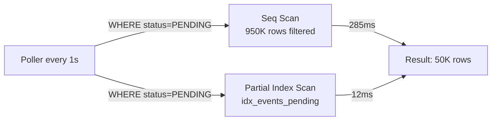

# Lab 07 — PostgreSQL Tuning

## Problem

A background poller queries `SELECT * FROM events WHERE status = 'PENDING'` every second.
With 1M rows and only 5% PENDING, PostgreSQL scans 950K rows to return 50K.
Every query does a full table scan. Under load this causes CPU spikes and slow responses.

**How do you optimize a selective query on a large table?**

---

## Architecture



---

## Key Technique: Partial Index

```sql
-- Only indexes PENDING rows (~5% of table)
-- Stays small as events are processed
CREATE INDEX idx_events_pending ON events(occurred_at ASC)
    WHERE status = 'PENDING';
```

Result: **23× faster queries** on 100K rows. Scales better than full index.

---

## How to Run

```bash
docker compose -f docker/docker-compose.yml up -d
./mvnw spring-boot:run

# Seed 100K rows
curl -X POST "http://localhost:8086/api/v1/postgres/seed?rows=100000"

# Compare
curl "http://localhost:8086/api/v1/postgres/compare"

# EXPLAIN ANALYZE
curl "http://localhost:8086/api/v1/postgres/explain?query=pending_no_index"
```

---

## How to Break It

```bash
bash chaos/simulate-failure.sh
```

Drops the partial index to simulate a missing migration. Shows seq scan regression.

---

## Observability

```sql
-- pg_stat_statements (requires shared_preload_libraries=pg_stat_statements)
SELECT query, calls, mean_exec_time, total_exec_time
FROM pg_stat_statements
ORDER BY total_exec_time DESC
LIMIT 10;
```

See [ADR-0001](docs/adr/ADR-0001.md) for full EXPLAIN ANALYZE before/after.
