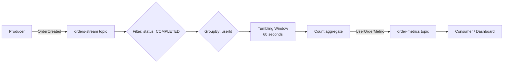

# Lab 08 — Kafka Streams: Real-Time Event Processing

## Problem

Order events flow into Kafka at high rate. Business needs real-time metrics:
"How many orders has each user placed in the last 60 seconds?"
A batch job running every minute has too much lag. A custom Kafka consumer with manual state is fragile.

**How do you aggregate streaming data with fault-tolerant windowed state?**

---

## Architecture



---

## How to Run

```bash
docker compose -f docker/docker-compose.yml up -d
./mvnw spring-boot:run

# Publish test orders
curl -X POST "http://localhost:8087/api/v1/streams/orders?userId=alice&status=COMPLETED"
curl -X POST "http://localhost:8087/api/v1/streams/orders?userId=alice&status=COMPLETED"
curl -X POST "http://localhost:8087/api/v1/streams/orders?userId=bob&status=PENDING"  # filtered out

# Check stream state
curl http://localhost:8087/api/v1/streams/status
```

---

## Unit Testing (No Broker)

```bash
./mvnw test
# Uses kafka-streams-test-utils (TopologyTestDriver)
# No Kafka broker needed for unit tests
```

---

## How to Break It

```bash
bash chaos/simulate-failure.sh
```

Restarts Kafka. Streams auto-recovers from changelog topics.

See [ADR-0001](docs/adr/ADR-0001.md) for Kafka Streams vs Flink trade-offs.
