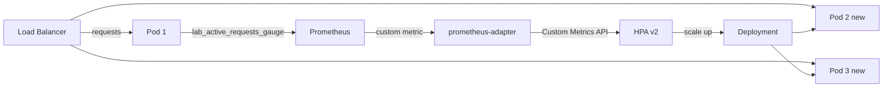

# Lab 10 — Kubernetes Autoscaling

## Problem

A Java service using virtual threads handles I/O-bound work.
CPU utilization stays low (~5%) even under heavy load (virtual threads don't consume CPU while waiting).
CPU-based HPA never triggers. Service degrades under load without scaling.

**How do you autoscale a service that doesn't consume CPU proportionally to load?**

---

## Architecture



---

## HPA Configuration

```yaml
metrics:
  - type: Pods
    pods:
      metric:
        name: lab_active_requests_gauge
      target:
        type: AverageValue
        averageValue: "10"  # Scale when avg > 10 active requests per pod
```

---

## How to Run (Local)

```bash
./mvnw spring-boot:run

# Test probes
curl http://localhost:8089/actuator/health/liveness
curl http://localhost:8089/actuator/health/readiness

# Check custom metric
curl http://localhost:8089/actuator/prometheus | grep lab_active_requests
```

## How to Run (Kubernetes)

```bash
kubectl apply -f scripts/k8s/deployment.yml
kubectl apply -f scripts/k8s/hpa.yml
watch kubectl get hpa lab10-hpa
```

---

## How to Break It

```bash
bash chaos/simulate-failure.sh
```

Spikes queue depth metric to simulate scale-up trigger without real traffic.

---

## Graceful Shutdown

Spring Boot configured with `server.shutdown=graceful`.
- SIGTERM received → app stops accepting new requests
- In-flight requests complete (up to 30s)
- Pod terminates cleanly — no request failures during rollout

See [ADR-0001](docs/adr/ADR-0001.md).
