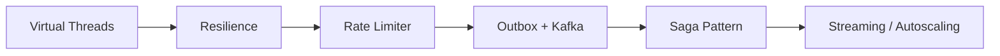

# 🏗️ Java Production Labs

Repositorio de **laboratorios de ingeniería de producción real**, diseñados para demostrar decisiones técnicas, comportamiento bajo carga y gestión de fallos.
No son ejercicios académicos: cada lab es **ejecutable, medible y defendible en entorno profesional**.

---

## 🚧 CI Status


---

## ⚙️ Stack Tecnológico


---

## 🖥️ Requisitos Previos

* Java 21 (SDKMAN recomendado)
* Maven 3.9+
* Docker 24+ & Docker Compose v2
* k6
* Make (opcional)

---

## 📚 Labs

| #  | Lab                    | Concepto Clave                   | Estado  |
| -- | ---------------------- | -------------------------------- | ------- |
| 01 | Virtual Threads        | Concurrencia moderna (Loom)      | pending |
| 02 | Resilience             | Circuit Breaker, Retry, Bulkhead | pending |
| 03 | Rate Limiter           | Control de tráfico distribuido   | pending |
| 04 | Transactional Outbox   | Consistencia + mensajería        | pending |
| 05 | Saga Pattern           | Transacciones distribuidas       | pending |
| 06 | Redis vs Kafka         | Trade-offs mensajería            | pending |
| 07 | PostgreSQL Tuning      | Optimización de queries          | pending |
| 08 | Kafka Streams          | Procesamiento de eventos         | pending |
| 09 | Docker Optimization    | Imágenes + JVM tuning            | pending |
| 10 | Kubernetes Autoscaling | Escalado automático              | pending |

---

## 📏 Matriz de Calidad por Lab

| Lab | ADR | Tests | Testcontainers | Benchmark | Observabilidad | Failure Mode |
| --- | --- | ----- | -------------- | --------- | -------------- | ------------ |
| 01  | ⬜   | ⬜     | ⬜              | ⬜         | ⬜              | ⬜            |
| 02  | ⬜   | ⬜     | ⬜              | ⬜         | ⬜              | ⬜            |
| 03  | ⬜   | ⬜     | ⬜              | ⬜         | ⬜              | ⬜            |
| 04  | ⬜   | ⬜     | ⬜              | ⬜         | ⬜              | ⬜            |
| 05  | ⬜   | ⬜     | ⬜              | ⬜         | ⬜              | ⬜            |
| 06  | ⬜   | ⬜     | ⬜              | ⬜         | ⬜              | ⬜            |
| 07  | ⬜   | ⬜     | ⬜              | ⬜         | ⬜              | ⬜            |
| 08  | ⬜   | ⬜     | ⬜              | ⬜         | ⬜              | ⬜            |
| 09  | ⬜   | ⬜     | ⬜              | ⬜         | ⬜              | ⬜            |
| 10  | ⬜   | ⬜     | ⬜              | ⬜         | ⬜              | ⬜            |

---

## ▶️ Ejecutar un lab

Cada lab es autónomo.

```bash
cd 01_virtual_threads
docker-compose -f docker/docker-compose.yml up -d
./mvnw spring-boot:run
```

O usar:

```bash
make help
```

---

## 🏛️ Arquitectura General



---

## 📊 Observabilidad

* Grafana: [http://localhost:3000](http://localhost:3000)
* Prometheus: [http://localhost:9090](http://localhost:9090)

---

## 👔 Para Reclutadores / Evaluadores

* Cada lab incluye README técnico con decisiones y trade-offs
* ADRs documentados en `docs/adr/`
* Benchmarks reproducibles (k6 / JMH)
* Tests de integración con Testcontainers (sin mocks de infra)
* Escenarios de fallo definidos y demostrables

---

## 🧠 Base Teórica

Basado en el repositorio **DAM-Java-Mastery** (documentación Staff).

---

## 👤 Sobre este proyecto

Repositorio construido como demostración práctica de ingeniería backend avanzada.
Enfocado a sistemas reales, no ejemplos académicos.

---

## 📄 Licencia

MIT License

---

## 🎯 Objetivo

Demostrar capacidad real de:

* Diseñar sistemas backend robustos
* Tomar decisiones con trade-offs claros
* Medir comportamiento bajo carga
* Operar sistemas en condiciones de fallo

---
